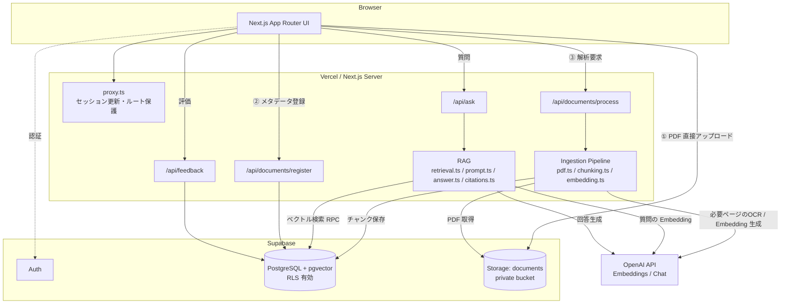
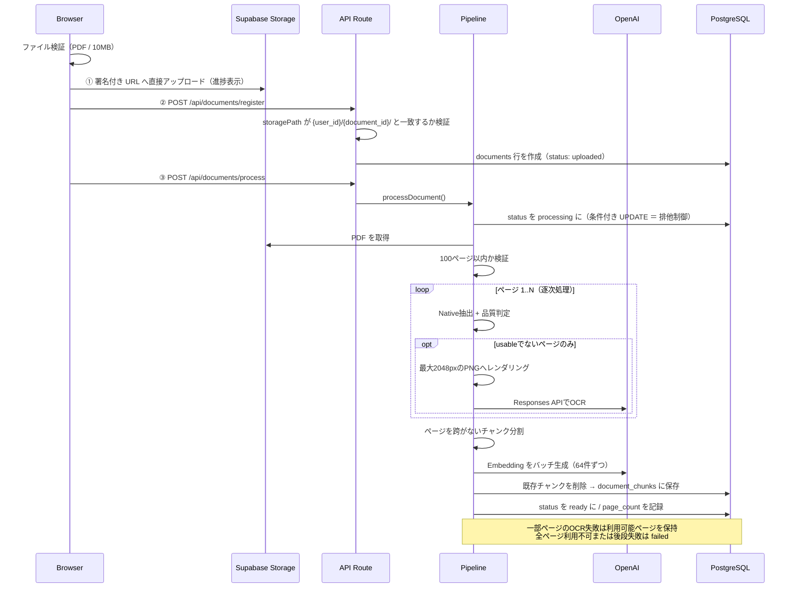
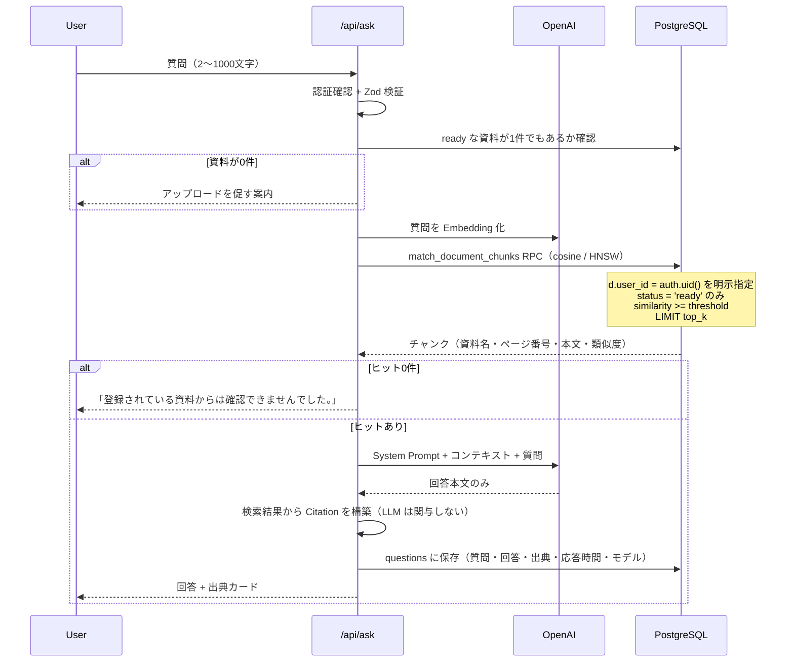

# Enterprise RAG Knowledge AI

**社内資料を、根拠付きで検索できるナレッジAI**

社内マニュアル・規程・FAQ などの PDF を登録すると、ページ単位のNativeテキスト抽出 → 必要ページのみOCR → チャンク分割 → Embedding → pgvector への保存が行われ、自然言語の質問に対して**登録済み資料の該当箇所だけ**を根拠に回答します。

回答には必ず **資料名・ページ番号・引用テキスト** が添えられ、利用者は AI の回答を原典で検証できます。

```
質問：有給休暇は何日前までに申請が必要ですか？

回答：年次有給休暇は、取得予定日の5営業日前までに所属長へ申請してください。
      やむを得ない事由による当日申請は、事後承認の対象となります。

出典 (2件)
 ┌ 就業規則.pdf  P.12   一致度 87%
 │ 「年次有給休暇の申請は、取得予定日の5営業日前までに所属長へ提出…」
 └ 就業規則.pdf  P.13   一致度 74%
   「やむを得ない事由により事前申請ができない場合は…」
```

---

## 目次

- [このプロジェクトの見どころ](#このプロジェクトの見どころ)
- [主な機能](#主な機能)
- [技術スタック](#技術スタック)
- [アーキテクチャ](#アーキテクチャ)
- [PDF 取り込みフロー](#pdf-取り込みフロー)
- [質問応答フロー](#質問応答フロー)
- [設計上の意思決定](#設計上の意思決定)
- [データベース設計](#データベース設計)
- [セキュリティ](#セキュリティ)
- [エラーハンドリング](#エラーハンドリング)
- [ローカル環境の構築](#ローカル環境の構築)
- [環境変数](#環境変数)
- [Supabase セットアップ](#supabase-セットアップ)
- [Vercel へのデプロイ](#vercel-へのデプロイ)
- [テスト](#テスト)
- [既知の制限](#既知の制限)
- [今後の拡張](#今後の拡張)

---

## このプロジェクトの見どころ

RAG は「それらしい回答」を作るだけなら簡単ですが、**業務で使えるかどうかは、回答を検証できるかどうか**で決まります。本プロジェクトはそこを設計の中心に置いています。

| 論点 | 本実装の方針 |
|---|---|
| **Citation の生成主体** | LLM に出典を書かせず、**アプリ側が検索結果から構築**。存在しないページ番号が生成されることが原理的にない |
| **ページ番号の保持** | PDF を一括文字列化せず、**ページ単位で抽出 → ページを跨がないチャンク分割**。1チャンク＝1ページなので出典が一意に決まる |
| **回答範囲の限定** | System Prompt でコンテキスト限定を明示し、根拠がなければ「登録されている資料からは確認できませんでした。」を返す |
| **テナント分離** | RLS に加えて、検索 RPC 内で `d.user_id = auth.uid()` を**明示的に**指定。ポリシー欠落時も他人のチャンクは返らない |
| **PDF アップロード経路** | ブラウザ → Supabase Storage へ**直接**アップロード。Serverless Function に 10MB のボディを通さない |
| **スキャン・mixed PDF** | ページごとにNative抽出品質を判定し、usableでないページだけをOCR。テキストページを無条件に画像送信しない |
| **失敗時の状態整合** | 途中失敗した資料は `ready` にせず、生成済みチャンクを削除してから `failed` に。中途半端な検索対象を残さない |

---

## 主な機能

### 認証
- Email + Password による新規登録 / ログイン / ログアウト
- Supabase SSR 方式によるセッション維持（Proxy でのトークン自動更新）
- 未ログイン時の保護ルートアクセス防止（Proxy + Layout の二重チェック）
- セッション期限切れ時の `/login` への誘導（`redirectedFrom` で復帰先を保持）

### ダッシュボード
- 登録資料数 / 解析完了数 / 累計質問数 / Helpful率
- 最近登録した資料・最近の質問
- 資料が無い場合の Empty State と導線

### 資料管理 `/documents`
- ドラッグ＆ドロップ / ファイル選択
- PDF 形式・10MB・100ページの検証
- 日本語・英語・混在テキストPDFとスキャンPDFの自動判定
- **実測値によるアップロード進捗表示**（XHR + 署名付きアップロード URL）
- 解析状態の可視化（待機中 / 解析中 / 利用可能 / 失敗）
- 失敗時の再試行（既存チャンクを cleanup してから再解析）
- 削除（Storage・チャンク・メタデータの整合を保つ）

### AI に質問 `/ask`
- Idle / Loading / Success / No result / Error の明示的な状態管理
- 二重送信防止・文字数制限・空入力拒否
- **出典カード**（資料名・ページ番号・引用文・一致度）
- Helpful / Not Helpful 評価

### 質問履歴 `/history`
- 質問・回答・出典・評価・応答時間・モデル名の記録
- 詳細画面で回答全文と出典を再確認
- 自分の履歴のみ表示（RLS）

---

## 技術スタック

| 領域 | 採用技術 |
|---|---|
| フレームワーク | Next.js 16 (App Router) / React 19 |
| 言語 | TypeScript (strict) |
| スタイル | Tailwind CSS v4 |
| アイコン | Lucide React |
| 認証 | Supabase Auth (`@supabase/ssr`) |
| データベース | Supabase PostgreSQL |
| ベクトル検索 | pgvector (HNSW / cosine) |
| ファイル保存 | Supabase Storage (private bucket) |
| Embedding | OpenAI `text-embedding-3-small` (1536次元) |
| 回答生成 | OpenAI Chat Completions (`OPENAI_CHAT_MODEL`) |
| OCR fallback | OpenAI Responses API + Vision (`OPENAI_OCR_MODEL`) |
| バリデーション | Zod |
| テスト | Vitest / React Testing Library |

PDF 解析には **`pdfjs-dist`（legacy build）** を使用しています。同梱CMapと標準フォントデータをNode側で明示し、ページ単位で `getTextContent()` を実行します。文字数・空白除去後文字数・文字化け率が基準に届かないページだけ `@napi-rs/canvas` でPNG化し、OpenAI Visionへ送るため、**ページ番号を正確に保持したまま**Native/OCRを混在できます。

---

## アーキテクチャ



### ディレクトリ構成

```
src/
├── app/
│   ├── (auth)/              ログイン / 新規登録
│   ├── (app)/               認証必須の画面（サイドバー付きシェル）
│   │   ├── dashboard/
│   │   ├── documents/
│   │   ├── ask/
│   │   └── history/[id]/
│   ├── api/
│   │   ├── documents/register/   メタデータ登録
│   │   ├── documents/process/    取り込みパイプライン実行
│   │   ├── documents/[id]/       削除
│   │   ├── ask/                  RAG 本体
│   │   └── feedback/             回答評価
│   └── auth/callback/       メール確認からのセッション確立
├── components/              UI（ask / documents / layout / ui）
├── lib/
│   ├── config/
│   │   ├── rag.ts           RAG パラメータの集約（純粋関数）
│   │   ├── env.ts           サーバー環境変数（server-only + Zod）
│   │   └── public-env.ts    ブラウザに出してよい値のみ
│   ├── rag/
│   │   ├── pdf.ts           ページ単位テキスト抽出
│   │   ├── chunking.ts      ページを跨がないチャンク分割（純粋関数）
│   │   ├── embedding.ts     バッチ Embedding
│   │   ├── retrieval.ts     pgvector 検索
│   │   ├── prompt.ts        System Prompt / コンテキスト構築（純粋関数）
│   │   ├── answer.ts        回答生成
│   │   ├── citations.ts     出典構築（純粋関数）
│   │   └── ingest.ts        取り込みパイプライン
│   ├── supabase/            client / server / admin / proxy-session
│   ├── validation/          Zod スキーマ・ファイル検証
│   └── errors.ts            AppError と利用者向けメッセージ
├── proxy.ts                 セッション更新・ルート保護
supabase/migrations/         スキーマ・RLS・RPC・Storage ポリシー
tests/                       Vitest
```

---

## PDF 取り込みフロー



### ページ番号が保たれる仕組み

```
PDF (3ページ)
 ├ page 1 ─ getTextContent() ─→ text ─→ chunk(page:1, index:0), chunk(page:1, index:1)
 ├ page 2 ─ getTextContent() ─→ text ─→ chunk(page:2, index:0)
 └ page 3 ─ getTextContent() ─→ text ─→ chunk(page:3, index:0)
                                          └─ この page 番号がそのまま出典の P.n になる
```

PDF 全体を 1 本の文字列に連結してから分割する実装では、チャンクがどのページ由来か復元できません。本実装は**ページごとに独立してチャンク化**するため、チャンクとページが 1 対 1 に対応します。

---

## 質問応答フロー



---

## 設計上の意思決定

面接で説明できるよう、「なぜそうしたか」を明示します。

### なぜ pgvector か
資料メタデータ（`documents`）と検索対象（`document_chunks`）が同一の PostgreSQL 内にあるため、**所有権による絞り込みと類似度検索を 1 クエリで実行**できます。外部ベクトル DB を使うと、テナント分離を DB とベクトルストアの二重管理にする必要があり、権限の食い違いがそのまま情報漏洩になります。RLS がそのまま検索にも効くことが最大の利点です。

### なぜページ番号をチャンクの属性として持つか
出典の価値は「検証できること」にあります。ページ番号が無い出典は、利用者が原典を開いて確認できないため、実質的に検証不能です。後から本文を検索してページを逆引きする方法もありますが、同じ文言が複数ページにあると一意に定まりません。**抽出時点で確定したページ番号を保持する**のが唯一確実な方法です。

### なぜ Citation を LLM に生成させないか
LLM に「出典を書け」と指示すると、**存在しないページ番号をもっともらしく生成**します。しかも出典は「検証済み」に見えるため、誤った出典は出典が無いより有害です。本実装では、表示される資料名・ページ番号・引用文はすべて `match_document_chunks` が返した行そのものであり、モデルの出力を経由しません。モデルの役割は文章化のみです。

### なぜ RLS が必要か
社内資料は本質的に機密です。アプリ側のクエリに `.eq('user_id', user.id)` を書き忘れる事故は現実に起こります。RLS はその 1 行が欠けても DB 側で遮断します。さらに検索 RPC は `SECURITY INVOKER` とし、関数内に所有者条件も明記しています（`SECURITY DEFINER` は RLS を迂回するため、検索関数には使ってはいけません）。

### なぜ PDF を API 経由でアップロードしないか
Serverless Function に 10MB のファイルを通すと、リクエストボディ上限に当たり、関数内で全体をバッファし、その実行時間に課金されます。**結局 Storage に渡すだけ**なので、ブラウザから直接アップロードするほうが速く安く、関数の実行時間は解析・Embedding という本当にサーバーが必要な処理に使えます。バケットのポリシーが `{user_id}/...` を強制するため、直接アップロードでも他人の領域には書き込めません。

### なぜ回答をコンテキスト限定にするか
一般知識で補完してしまうと、**回答本文と出典が食い違います**。「就業規則にこう書いてある」と読める文章の根拠が、実はモデルの事前学習知識だった、という状態は業務利用では致命的です。根拠が無い場合に「確認できませんでした」と答えられることは、機能の欠如ではなく品質保証です。

### なぜ Feedback を保存するか
RAG の品質は「検索が当たっているか」で決まりますが、これは自動計測が困難です。Helpful / Not Helpful を **質問・検索結果・モデル名と同じ行に紐づけて**保存することで、「どういう質問で検索が外れるか」を後から分析でき、チャンクサイズや類似度しきい値のチューニング根拠になります。

---

## データベース設計

### テーブル

| テーブル | 役割 | 主なポイント |
|---|---|---|
| `profiles` | ユーザープロフィール | `auth.users` と 1:1。サインアップ時にトリガで自動作成 |
| `documents` | 登録 PDF のメタデータ | `status` (uploaded/processing/ready/failed)、`storage_path` に UNIQUE |
| `document_chunks` | チャンク + Embedding | `vector(1536)`、`(document_id, page_number, chunk_index)` に UNIQUE |
| `questions` | 質問・回答・出典 | `sources` は JSONB。回答時点のスナップショット |
| `answer_feedback` | 回答評価 | `(question_id, user_id)` に UNIQUE → 再評価は UPSERT |

### インデックス

| インデックス | 目的 |
|---|---|
| `document_chunks_embedding_hnsw_idx` | **HNSW / `vector_cosine_ops`** による近似最近傍検索 |
| `documents_user_id_created_at_idx` | 資料一覧・ダッシュボードの取得 |
| `documents_user_id_status_idx` | `ready` 件数の集計 |
| `document_chunks_document_id_idx` | 削除・再解析時のチャンク操作 |
| `questions_user_id_created_at_idx` | 履歴一覧 |

### RPC

```sql
match_document_chunks(query_embedding vector(1536), match_threshold float, match_count int)
```

- `SECURITY INVOKER`（**`SECURITY DEFINER` にしない**）
- `d.user_id = auth.uid()` を明示的に指定
- `d.status = 'ready'` のみを対象
- `1 - (embedding <=> query_embedding) >= threshold`
- `ORDER BY embedding <=> query_embedding LIMIT least(greatest(match_count,1),50)`
- 引数に `user_id` を**受け取らない**（他人を指定する余地を作らない）

### ON DELETE の設計

```
auth.users ──cascade──> profiles
           ──cascade──> documents ──cascade──> document_chunks
           ──cascade──> questions ──cascade──> answer_feedback
```

資料を削除するとチャンクも必ず消えるため、「実体の無い資料を引用する」状態が発生しません。

---

## セキュリティ

### 鍵の分離

| 変数 | 公開範囲 | 用途 |
|---|---|---|
| `NEXT_PUBLIC_SUPABASE_URL` | ブラウザ可 | エンドポイント |
| `NEXT_PUBLIC_SUPABASE_ANON_KEY` | ブラウザ可 | RLS 前提の匿名キー |
| `SUPABASE_SERVICE_ROLE_KEY` | **サーバーのみ** | RLS を迂回。PDF 取得・チャンク書込・Storage 削除 |
| `OPENAI_API_KEY` | **サーバーのみ** | OCR / Embedding / 回答生成 |

秘密値を含む `src/lib/config/env.ts` と `src/lib/supabase/admin.ts` は先頭で `import 'server-only'` しています。Client Component から誤って import すると**ビルドが失敗する**ため、リファクタリング時の事故を型・ビルドレベルで防いでいます。

### Row Level Security

全テーブルで RLS 有効。

| テーブル | ポリシー |
|---|---|
| `profiles` | `auth.uid() = id`（本人のみ参照・更新） |
| `documents` | `auth.uid() = user_id`（全操作） |
| `document_chunks` | 親 `documents` の所有者経由（`EXISTS` サブクエリ） |
| `questions` | `auth.uid() = user_id` |
| `answer_feedback` | `auth.uid() = user_id`、かつ**自分の質問に対してのみ** INSERT 可 |

`(select auth.uid())` の形で記述し、行ごとではなくステートメントごとに評価されるようにしています（チャンク検索で効きます）。

### Storage ポリシー

`documents` は **private bucket**（公開 URL なし）。パスは `{user_id}/{document_id}/{safe_filename}`。

```sql
bucket_id = 'documents'
and (select auth.uid())::text = (storage.foldername(name))[1]
```

先頭フォルダが自分の `user_id` である場合のみ select / insert / update / delete が可能です。

### 入力検証

- ファイル: MIME `application/pdf` **かつ** 拡張子 `.pdf`、10MB 以下、1〜100ページ
- ファイル名: 制御文字・ディレクトリ区切り・`..` を除去し、`[a-zA-Z0-9._-]` のみに正規化
- Storage パス: `user_id` / `document_id` が UUID であることを検証してから組み立て（`/` や `..` の混入が原理的に不可能）
- サーバー側でも `storagePath` が `{認証ユーザーの id}/{document_id}/` で始まることを再検証
- 質問: 2〜1000文字（UI・API・DB CHECK の三層で一致）

### エラー詳細の非開示

すべてのエラーは `AppError` に正規化され、レスポンスには**利用者向けメッセージとコードのみ**を返します。スタックトレース・SQL・ドライバのメッセージは `console.error` でサーバーログにのみ出力されます。この不変条件は `tests/errors.test.ts` で検証しています。

---

## エラーハンドリング

| 状況 | 利用者への表示 | 資料の状態 |
|---|---|---|
| PDF 以外 | PDFファイルのみアップロードできます。 | 作成しない |
| 10MB 超過 | ファイルサイズは10MB以下にしてください。 | 作成しない |
| 100ページ超過 | ページ数は100ページ以下のPDFをご利用ください。 | `failed` |
| 破損 / 暗号化 PDF | このPDFを読み取れませんでした。破損または保護されている可能性があります。 | `failed` |
| Native/OCRともに文字なし | このPDFから読み取り可能なテキストを取得できませんでした。 | `failed` |
| OCR API失敗 / timeout（全ページ） | 画像文字解析の失敗 / timeoutを案内 | `failed` |
| OCR失敗（一部ページのみ） | 読み取れなかったページ番号を警告 | `ready`（利用可能ページのみ） |
| Storage 失敗 | ファイルの保存・取得に失敗しました。 | `failed` |
| Embedding 失敗 | 資料の解析に失敗しました。 | `failed`（チャンクは削除） |
| 検索失敗 | 資料の検索に失敗しました。 | — |
| 回答生成失敗 | 回答の生成に失敗しました。 | — |
| 二重処理 | この資料は現在処理中です。 | 変更しない |
| セッション切れ | ログインが必要です。 | — |

`failed` の資料は一覧に理由とともに表示され、**再試行**ボタンから再解析できます。再試行時は既存チャンクを削除してから処理するため、チャンクが重複しません。

---

## ローカル環境の構築

### 前提

- Node.js 20 以上（開発は Node 24 で実施）
- Supabase プロジェクト
- OpenAI API キー

### 手順

```bash
# 1. 依存関係
npm install

# 2. 環境変数
cp .env.example .env.local
#   .env.local を編集して実際の値を設定（.env.local は Git 管理外）

# 3. Supabase のマイグレーション適用（下記「Supabase セットアップ」参照）

# 4. 開発サーバー
npm run dev
```

### スクリプト

| コマンド | 内容 |
|---|---|
| `npm run dev` | 開発サーバー |
| `npm run build` | 本番ビルド |
| `npm run start` | 本番サーバー |
| `npm run lint` | ESLint |
| `npm run typecheck` | `tsc --noEmit` |
| `npm run test` | Vitest |
| `npm run test:watch` | Vitest（watch） |

---

## 環境変数

| 変数名 | 必須 | 説明 |
|---|---|---|
| `NEXT_PUBLIC_SUPABASE_URL` | ✅ | Supabase プロジェクト URL |
| `NEXT_PUBLIC_SUPABASE_ANON_KEY` | ✅ | 匿名キー（RLS 前提のため公開可） |
| `SUPABASE_SERVICE_ROLE_KEY` | ✅ | **秘密**。サーバー専用 |
| `OPENAI_API_KEY` | ✅ | **秘密**。サーバー専用 |
| `OPENAI_CHAT_MODEL` | 任意 | 既定 `gpt-4o-mini` |
| `OPENAI_OCR_MODEL` | 任意 | OCR専用。既定 `gpt-5-mini` |
| `RAG_TOP_K` | 任意 | 既定 `5`（1〜20 にクランプ） |
| `RAG_SIMILARITY_THRESHOLD` | 任意 | 既定 `0.3`（0〜1 にクランプ） |
| `RAG_CHUNK_SIZE` | 任意 | 既定 `1000`（200〜4000 にクランプ） |
| `RAG_CHUNK_OVERLAP` | 任意 | 既定 `150`（チャンクサイズの 1/2 まで） |

> Embedding モデルは環境変数化していません。`text-embedding-3-small` の 1536 次元が `vector(1536)` と対応しているため、変更は**マイグレーションを伴う設計変更**であり、環境変数で切り替えるべきものではないからです。

---

## Supabase セットアップ

### 1. マイグレーションの適用

`supabase/migrations/` の SQL がスキーマの正本です。Dashboard での手作業に依存しません。

**Supabase CLI（推奨）**

```bash
supabase link --project-ref <your-project-ref>
supabase db push
```

**Dashboard から適用する場合**

SQL Editor で以下の順に実行します。

1. `0001_extensions_and_tables.sql` — 拡張・テーブル・インデックス（HNSW 含む）・トリガ
2. `0002_row_level_security.sql` — RLS 有効化とポリシー
3. `0003_match_document_chunks.sql` — ベクトル検索 RPC
4. `0004_storage.sql` — `documents` バケットと Storage ポリシー
5. `0005_rpc_grant_hardening.sql` — 検索 RPC の EXECUTE 権限を `authenticated` のみに限定

> `0005` の補足: Supabase は `public` スキーマに作成された関数へ、`ALTER DEFAULT PRIVILEGES` により `anon` を含む EXECUTE 権限を自動付与します。これは `anon` ロールへの明示的な付与であるため、`0003` の `revoke ... from public` では取り消されません。RPC は SECURITY INVOKER かつ `d.user_id = auth.uid()` で絞り込むため匿名呼び出しでも 0 件しか返りませんが、意図どおり「未認証では実行そのものができない」状態にするための追加マイグレーションです。

### 1-b. ローカル Supabase での検証（任意）

本番プロジェクトを使わずに、マイグレーション・RLS・Storage ポリシー・ベクトル検索を一通り検証できます（Docker が必要）。

```bash
supabase start          # 初回はイメージ取得のため数分かかります
supabase db reset       # 0001〜0005 をゼロから順に再適用
supabase status         # API URL と各キーを表示
```

`supabase/config.toml` はこのローカル環境の定義です。ここで発行されるキーはローカル専用の既定値で、本番の秘密情報とは無関係です。

### 2. Storage

`0004_storage.sql` がバケットを作成します（private / 10MB / `application/pdf` のみ）。Dashboard で `documents` バケットが **Public でない**ことを確認してください。

### 3. Auth

Authentication → Providers で **Email** を有効化します。

- **メール確認を有効にする場合**: Redirect URLs に `http://localhost:3000/auth/callback` と本番の `https://<your-domain>/auth/callback` を登録してください。
- **ローカル検証を簡単にしたい場合**: Email confirmation を一時的に無効化すると、登録直後にセッションが発行されます。

### 4. 動作確認

1. `/register` でアカウント作成
2. `/documents` でテキストPDFまたはスキャンPDFをアップロード
3. ステータスが `解析中` → `利用可能` に変わることを確認
4. `/ask` で資料の内容について質問し、出典のページ番号が実際の PDF と一致することを確認

---

## Vercel へのデプロイ

1. GitHub リポジトリを Vercel にインポート（Framework: Next.js、設定は既定のまま）
2. Environment Variables に以下を登録
   - `NEXT_PUBLIC_SUPABASE_URL`
   - `NEXT_PUBLIC_SUPABASE_ANON_KEY`
   - `SUPABASE_SERVICE_ROLE_KEY`
   - `OPENAI_API_KEY`
   - 必要に応じて `OPENAI_CHAT_MODEL` / `OPENAI_OCR_MODEL` / `RAG_*`
3. Supabase の Auth Redirect URLs に本番ドメインの `/auth/callback` を追加
4. Deploy

**関数の実行時間について**: `/api/documents/process` は `maxDuration = 300` を宣言しています。Hobby プランでは上限が短いため、大きな PDF がタイムアウトする場合があります（[既知の制限](#既知の制限)参照）。

本番ビルドは `next build --webpack` に固定しています。PDF.jsが実行時に読むCMap・標準フォント資材と、`@napi-rs/canvas` のプラットフォーム別バイナリをVercelのServerless Functionへ確実にトレースするためです。

---

## テスト

```bash
npm run test
```

`183 tests / 14 files`（2026-09-09 時点。外部連携2ファイルは既定でskip）。ロジックを純粋関数に分離しているため、外部サービスなしで中核を検証できます。

これに加えて、実際の Supabase インスタンスに接続する統合テスト（38件）と、実OpenAI APIで日本語OCR・回答・cross-language embeddingを確認するテスト（2件）があります。既定ではスキップされ、明示的に接続情報や実行フラグを渡したときだけ実行されます。

```bash
supabase start
supabase status                     # 表示された値を下の 3 変数に設定
export SUPABASE_INTEGRATION_URL=<API URL>
export SUPABASE_INTEGRATION_ANON_KEY=<anon key>
export SUPABASE_INTEGRATION_SERVICE_ROLE_KEY=<service_role key>
npm run test                        # 221 tests pass / OpenAI 2 tests skip
```

`OPENAI_API_KEY` は不要です。統合テストは決定的なローカル Embedding 関数を使うため、OpenAI へ接続せずに pgvector 検索・出典ページ番号・テナント分離まで検証できます（LLM の生成文だけが対象外）。

実OpenAI APIを使う検証は、API利用料金が発生するため明示的に有効化します。

```bash
RUN_OPENAI_INTEGRATION=1 node --env-file=.env.local node_modules/vitest/vitest.mjs run tests/integration/openai.integration.test.ts
```

| ファイル | 検証内容 |
|---|---|
| `chunking.test.ts` | ページを跨がないこと、オーバーラップ、境界選択、**無限ループしないこと**（区切り無し・過大 overlap） |
| `citations.test.ts` | 出典の構築、同一ページの重複排除、類似度順、抜粋の切り詰め |
| `document-validation.test.ts` | MIME/拡張子/サイズ、ファイル名サニタイズ、**パストラバーサル防止**、Storage パス構築 |
| `question-validation.test.ts` | 文字数境界、空入力、スキーマ検証 |
| `prompt.test.ts` | System Prompt の制約（コンテキスト限定・出典を書かせない） |
| `rag-config.test.ts` | 環境変数のパースとクランプ、`EMBEDDING_DIMENSIONS` と `vector(1536)` の整合 |
| `errors.test.ts` | **内部エラー詳細がレスポンスに漏れないこと**、HTTP ステータス対応 |
| `citation-card.test.tsx` | 出典カードの描画（資料名・P.n・引用文・一致度） |
| `server-env.test.ts` | Supabase 設定と OpenAI 設定が独立に検証されること、エラーが変数名のみを出し値を漏らさないこと |
| `integration/supabase.integration.test.ts` | **実 DB 接続**。マイグレーション適用結果、`vector(1536)`、PostgREST 経由の `match_document_chunks`、RLS のテナント分離、Storage ポリシー、Feedback UPSERT、再処理の冪等性、削除の整合性 |
| `pdf-text.test.ts` | テキスト結合（日本語に不要な空白を入れない）、正規化 |
| `pdf-extraction.test.ts` | 日本語ToUnicode Native抽出、scan OCR、native/scan/native mixed PDF、ページ番号、破損・保護PDF、OCR失敗・timeout・部分成功 |
| `ocr.test.ts` | Responses API画像入力、OCR専用モデル、high detail、非保存設定 |
| `integration/openai.integration.test.ts` | **実API（opt-in）**。日本語scan OCR→日本語回答→Citation、英語資料への日本語質問のEmbedding類似度 |
| `format.test.ts` | バイト数・日時（タイムゾーン固定）・時間・切り詰め |

---

## 既知の制限

- **OCR精度は原稿品質に依存** — 低解像度、手書き、極端な傾き、複雑な表では文字を取得できない場合があります。一部ページだけ失敗した場合はページ番号付き警告を残し、取得できたページは検索対象にします。
- **PDF のみ対応** — Word・Excel・PowerPoint・HTML は未対応です。
- **同期的な取り込み処理** — `/api/documents/process` がリクエスト内で抽出・Embedding まで完了させます。100ページ / 10MB という上限内では現実的ですが、大規模運用ではジョブキュー（Supabase Queues、Inngest 等）による非同期化が必要です。Vercel Hobby プランでは関数の実行時間上限により、大きな PDF がタイムアウトする可能性があります。
- **ベクトル検索のフィルタ方式** — 所有者による絞り込みを `documents` との JOIN で行っています。数万チャンク規模までは問題ありませんが、大規模化する場合は `document_chunks` に `user_id` を非正規化し、パーティションまたは複合インデックスで絞り込む設計が有効です。
- **リランキングなし** — 類似度上位 K 件をそのまま使用します。Cross-Encoder による再ランキングは未実装です。
- **回答のストリーミング未対応** — 回答は生成完了後に一括表示されます。
- **単一ユーザー単位のテナント分離** — 分離の単位は「ユーザー」です。組織で資料を共有する運用には、組織テーブルとメンバーシップに基づく RLS への拡張が必要です。
- **アプリ側のレート制限なし** — OpenAI 側のレート制限に依存しています。
- **Native抽出不能なフォント構造** — 同梱CMapとToUnicodeを利用しても文字対応を復元できない独自エンコーディングは、ページ単位OCRへフォールバックします。

---

## 今後の拡張

- OCR結果のレイアウト・表構造を保持するStructured Output
- ジョブキューによる取り込みの非同期化と進捗のリアルタイム表示
- ハイブリッド検索（全文検索 + ベクトル検索）と Cross-Encoder リランキング
- 回答のストリーミング表示
- 組織 / チーム単位の資料共有と権限管理
- 出典クリックで該当ページをプレビュー表示
- Not Helpful が付いた質問の分析ダッシュボード
- Word / Excel / PowerPoint 対応

---

## ライセンス

ポートフォリオ用途のプロジェクトです。
